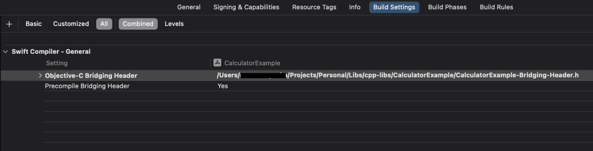

# C++ Calculator

![Platform][Platform]  ![Language][Language]

Calculator is an iOS CocoaPod that bridges C++ functionality to Swift via Objective-C. It wraps a simple C++ module and exposes it for Swift use, without needing to directly deal with C++ complexities. Perfect for those looking to integrate C++ into a Swift project effortlessly.

### Features

- C++ functionality accessible from Swift.
- Objective-C++ bridging layer.

### Installation

#### CocoaPods
To integrate MyPod into your iOS project, simply add the following line to your Podfile:

``` ruby
pod 'Calculator', :path => '../path_to_module'
```

Then run:

``` bash
pod install
```

#### XCode Configurations

##### Create Bridging Header
To create the bridging header, you need to go to `File` **->** `New` **->** `File from Template`, and then select Header File. For the name, just follow the pattern: `AppName-Briding-Header`.

##### Declaring Bridging Header to Swift Compiler
Open the project build settings, search for `Objective-C Bridging Header` and set the path to your Bridging Header File.



### Usage

When you use the Bridging Header there is no need to import the module like this `import Calculator`. Go straight to the class you want to use the methods, access the wrapper and call the method like this:

``` swift
let wrapper = ObjCWrapper()
let result = wrapper.addNumber(3, withNumber: 5)
print(result)  // Output: 8
```


[Platform]: https://img.shields.io/badge/platform%20-%20iPhone%20-%20lightblue
[Language]: https://img.shields.io/badge/language%20-%20Swift%20-%20orange